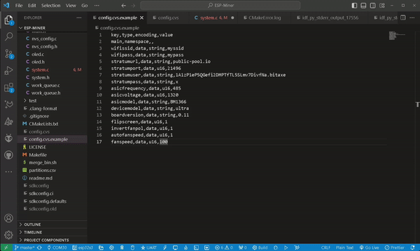
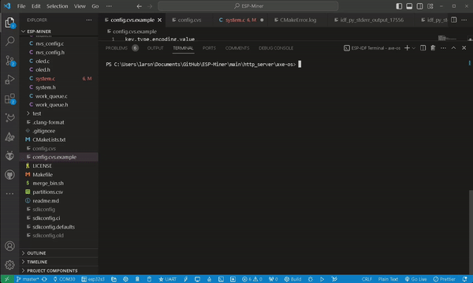

This guide shows you, how you can compile AxeOS yourself. It is split into three sections for the operating systems:
1. 💻 [Windows](#-windows)
2. 🍏 [MacOS](#-macos) - *this does not exist yet*
3. 🐧 [Linux](#-linux) - *not finished yet*

## Requirements

- ESP IDF
- Espressif Tool VSCode
- This firmware is designed to run a Bitaxe v2+

## 💻 Windows

### 1. Installation

1. Install the Espressif tool from [here](https://docs.espressif.com/projects/esp-idf/en/latest/esp32/get-started/windows-setup.html).
  On this page, you will find a "Get Started" guide for installing this onto your machine.
2. Install [Visual Studio Code](https://code.visualstudio.com/).
3. Install the [Espressif IDF Extention](https://marketplace.visualstudio.com/items?itemName=espressif.esp-idf-extension) in VSCode.

### 2. Clone repository

Clone the [ESP-Miner](https://github.com/skot/ESP-Miner) repository and open it in VSCode.

### 3. Configuration

After you have installed everything we need to configure the Espressif Tool.

In Visual Studio Code go to `View` → `ESP-IDF: Device Configuration` → `Device Target` → `ESP-Miner` → `esp32s3` → `ESP-S3 via USB Bridge`


### 4. Build

Open an ESP-IDF terminal and cd into the `/main/http_server/axe-os/` folder because we need to build the WebUI first with:
```bash
npm run build
```
Because the firmware needs to be built from the root directory, cd back to it and then build the firmware with:
```bash
idf.py build
```





This will generate a `build` directory at the root of the project and there you will find the `www.bin`and the `esp-miner.bin` files. These will be uploaded to your Bitaxe.

## 🍏 MacOS
:::caution[This part of the page is not written yet.]
Help us to complete the wiki by using the "Edit page" button at the end of the page 👇
:::

## 🐧 Linux

### 1. Installation

To compile using ESP-IDF, you need to get the following packages. The command to run depends on which distribution of Linux you are using:

```bash title="Ubuntu & Debian"
sudo apt-get install git wget flex bison gperf python3 python3-pip python3-venv cmake ninja-build ccache libffi-dev libssl-dev dfu-util libusb-1.0-0
```

```bash title="CentOS 7 & 8"
sudo yum -y update && sudo yum install git wget flex bison gperf python3 cmake ninja-build ccache dfu-util libusbx
```

```bash title="Arch"
sudo pacman -S --needed gcc git make flex bison gperf python cmake ninja ccache dfu-util libusb
```

### 2. Get ESP-IDF

To build applications for the ESP32, you need the software libraries provided by Espressif in [ESP-IDF repository](https://github.com/espressif/esp-idf).

To get ESP-IDF, navigate to your installation directory and clone the repository with `git clone`, following instructions below specific to your operating system.

Open Terminal, and run the following commands:

```bash
mkdir -p ~/esp
cd ~/esp
git clone --recursive https://github.com/espressif/esp-idf.git
```

ESP-IDF is downloaded into `~/esp/esp-idf`.

### 3. Set up the Tools

Aside from the ESP-IDF, you also need to install the tools used by ESP-IDF, such as the compiler, debugger, Python packages, etc, for projects supporting ESP32.

```bash
cd ~/esp/esp-idf
./install.sh esp32s3
```

### 4. Setup Environments Variables

The installed tools are not yet added to the PATH environment variable. To make the tools usable from the command line, some environment variables must be set. ESP-IDF provides another script that does that.

In the terminal where you are going to use ESP-IDF, run:

```bash
. $HOME/esp/esp-idf/export.sh
```

**Note the space between the leading dot and the path!**

If you plan to use ESP-IDF frequently, you can create an alias for executing `export.sh`:

1. Copy and paste the following command to your shell's profile (`.profile`, `.bashrc`, `.zprofile`, etc.)

```bash
alias get_idf='. $HOME/esp/esp-idf/export.sh'
```

2. Refresh the configuration by restarting the terminal session or by running `source [path to profile]`, for example, `source ~/.bashrc`.

Now you can run `get_idf` to set up or refresh the ESP-IDF environment in any terminal session.

### Clone repository

Clone the [ESP-Miner](https://github.com/skot/ESP-Miner) repository and open it in VSCode.

:::caution[The next steps are not written yet.]
Help us to complete the wiki by using the "Edit page" button at the end of the page 👇
:::